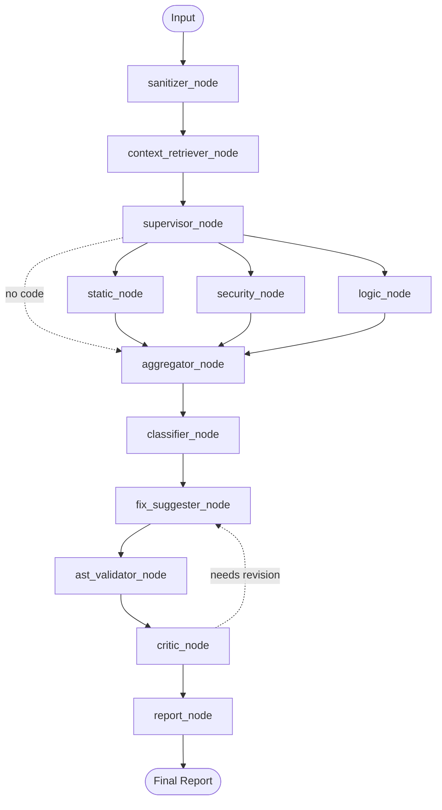

# AI-Powered Enterprise Code Review System

An automated, first-pass code review platform built on a **LangGraph multi-agent
pipeline**. It detects security vulnerabilities, business-logic flaws, leaked
secrets, and best-practice violations across any programming language — then
generates validated fix suggestions and routes high-severity findings through a
human-in-the-loop sign-off.

Reviews can be run on pasted code, a single file, a local Git repository, a
remote GitHub repository, or a GitHub Pull Request — and can be wired into CI to
review every PR automatically.

---
"""
graph/workflow.py — LangGraph Code Review Pipeline.

Full execution graph:

  Input
    │
    ▼
  sanitizer_node          Strips secrets from raw_code → sanitized_code
    │
    ▼
  context_retriever_node  Retrieves semantically related functions from
    │                     the shared ChromaDB index (optional; skipped if
    │                     no changed_functions in state)
    ▼
  supervisor_node         Decides which review agents to run based on the
    │                     sanitized code and settings
    │
  ┌─────────────────────────────┐
  │          │                  │
  ▼          ▼                  ▼
static_node  security_node  logic_node
  │          │                  │
  └─────────────────────────────┘
    │
    ▼
  aggregator_node         Merges all findings into a uniform list
    │
    ▼
  classifier_node         Groups findings by severity; computes summary
    │
    ▼
  report_node             Renders the final markdown report

Optional critic/human-in-the-loop nodes are wired but do not block the
default linear flow unless `needs_revision` or `human_decision` is set.

Usage
-----
  from graph.workflow import build_review_graph, run_review

  # Build once (expensive: compiles the graph)
  app = build_review_graph()

  # Run a review
  result = run_review(app, raw_code="import os; os.system(input())")
  print(result["final_report"])
"""

## Features

- **Multi-agent review pipeline** orchestrated with LangGraph (sanitizer, context
  retriever, supervisor, static analysis, security scanner, logic reviewer,
  aggregator, severity classifier, fix suggester, critic, report generator).
- **Secret sanitization** — API keys, tokens, passwords, and private keys are
  redacted *before* any code is sent to an external LLM (regex + `detect-secrets`).
- **Static analysis** — Bandit-based security linting for Python files.
- **RAG security scanner** — semantic retrieval over a local ChromaDB
  vulnerability knowledge base augments the LLM security audit with CWE references.
- **LLM logic reviewer** — reasons about correctness, edge cases, state
  transitions, authorization flaws, and control flow.
- **Self-correction loop** — a fix suggester proposes patches, an AST validator
  checks syntax, and a critic agent accepts or requests revisions (bounded retries).
- **Severity classification & aggregation** — findings from all agents are merged,
  deduplicated, and re-graded (Critical to Info).
- **Human-in-the-loop sign-off** — a genuine LangGraph interrupt backed by a
  SQLite checkpointer pauses the graph for reviewer approval.
- **Zero-clone GitHub integration** — diffs and file contents are fetched via the
  GitHub REST API without cloning.
- **Shared codebase indexing** — index a repository once so reviews can be
  enriched with semantically related functions and dependency links.
- **Provider-agnostic LLM layer** — Google Gemini or local Ollama.
- **Streamlit UI** and a **CI/CD GitHub Action** for automatic PR reviews.

---

## Architecture

The review pipeline is a compiled LangGraph `StateGraph`. The supervisor fans out
to the review agents in parallel, then fans back into aggregation,
classification, the optional critic loop, and report generation.



> The critic loop and the human sign-off node are optional and toggled at build
> time via `build_review_graph(enable_critic=..., enable_human_review=...)`.

### Pipeline stages

| Stage | Node | Responsibility |
|-------|------|----------------|
| 0 | `sanitizer_node` | Redact secrets from raw input |
| 1 | `context_retriever_node` | Pull related functions from the shared index (best-effort) |
| 2 | `supervisor_node` | Decide which review agents to run |
| 3a | `static_node` | Bandit static analysis (Python only) |
| 3b | `security_node` | RAG + LLM security scanning |
| 3c | `logic_node` | LLM business-logic review |
| 4 | `aggregator_node` | Merge, normalize, deduplicate findings |
| 5 | `classifier_node` | Re-grade severity and build the summary |
| 6 | `fix_suggester_node` / `ast_validator_node` / `critic_node` | Propose and verify fixes (self-correction loop) |
| 7 | `report_node` | Render the final markdown report |

---

## Technology Stack

| Layer | Technology |
|-------|------------|
| Orchestration | LangGraph · Python |
| LLM Providers | Google Gemini · Ollama |
| Static Analysis | Bandit · detect-secrets · AST |
| Vector Store | ChromaDB · sentence-transformers |
| Persistence | SQLite (LangGraph checkpoints) |
| UI | Streamlit |
| Ingestion | GitPython-style subprocess diff parsing · GitHub REST API |

---

## Project Structure

```
enterprise-code-reviewer/
├── main.py                  # Streamlit entrypoint (page shell + router)
├── config.py                # Pydantic settings loaded from .env
├── agents/                  # Review agents (sanitizer, security, logic, critic, ...)
├── graph/                   # LangGraph pipeline (workflow.py, state.py, studio_graph.py)
├── llm/                     # Provider abstraction (Gemini, Ollama) + factory
├── diff_processing/         # Git diff extraction, AST scoping, LLM chunking
├── context/                 # Semantic context retrieval over the shared index
├── indexing/                # Codebase indexing, dependency graph, summaries
├── storage/                 # ChromaDB vector store + SQLite checkpointer
├── tools/                   # AST validation, Bandit wrapper, GitHub client, PR bot
├── ui/                      # One Streamlit page module per feature
├── tests/                   # pytest suite
└── .github/workflows/       # CI action that reviews every PR
```

---

## Prerequisites

- **Python 3.11+** (3.13 recommended)
- **Git** (for local repository diffing)
- A **Google Gemini API key**, or a running **Ollama** instance
- Optional: a **GitHub token** for higher API rate limits and posting PR comments

---

## Installation

```bash
# 1. Clone and enter the project
cd enterprise-code-reviewer

# 2. Create and activate a virtual environment
python -m venv .venv
source .venv/bin/activate        # Windows: .venv\Scripts\activate

# 3. Install dependencies
pip install -r requirements.txt

# 4. Configure environment
cp .env.example .env
# then edit .env and add your GEMINI_API_KEY (or configure Ollama)
```

### Configuration (`.env`)

| Variable | Description | Default |
|----------|-------------|---------|
| `LLM_PROVIDER` | `gemini` or `ollama` | `gemini` |
| `GEMINI_API_KEY` | Google Gemini API key | — |
| `GEMINI_MODEL` | Gemini model name | `gemini-2.0-flash` |
| `OLLAMA_BASE_URL` | Ollama server URL | `http://localhost:11434` |
| `OLLAMA_MODEL` | Ollama model name | `llama3.2` |
| `APP_ENV` | `development` / `staging` / `production` | `development` |
| `LOG_LEVEL` | Logging verbosity | `INFO` |
| `SQLITE_DB_PATH` | Checkpoint database path | `./storage/reviews.db` |
| `CHROMA_PERSIST_DIR` | ChromaDB persistence directory | `./storage/chroma` |
| `MAX_FILE_SIZE_BYTES` | Max accepted file size | `524288` |

> Never commit `.env`. It is excluded via `.gitignore`.

---

## Running the App

```bash
streamlit run main.py
```

Then open the local URL Streamlit prints (default `http://localhost:8501`).

### Pages

- **Overview** — capabilities, tech stack, and the rendered agent graph.
- **Quick Review** — paste code or upload a file and run the full pipeline.
- **Git Diff Review** — review a local repo, GitHub repo URL, or GitHub PR URL.
- **Codebase Indexer** — index a repository to enable semantic context retrieval.
- **Human Sign-off** — approve or reject suggested fixes for paused reviews.
- **Final Reports** — browse generated review reports.
- **Sanitizer / Static Analysis / Logic Reviewer / RAG Security** — run individual agents.
- **LLM Abstraction** — provider playground and health checks.
- **System Health / Configuration / Roadmap** — status and settings.

The active LLM provider can be switched from the sidebar at runtime.

---

## Reviewing a GitHub Pull Request

### From the UI

Paste a PR URL (e.g. `https://github.com/owner/repo/pull/123`) into the
**Git Diff Review** repository field and click **Review Pull Request Now**. The
exact diff between the PR branch and its base is fetched via the GitHub API, and
you can optionally post the report back as a PR comment.

### From the CLI

```bash
python -m tools.pr_review_bot \
  --pr-url https://github.com/owner/repo/pull/123 \
  --post-comment
```

Flags:

- `--pr-url` — the Pull Request to review.
- `--post-comment` — post the final report as a PR comment (requires `GITHUB_TOKEN`).
- `--no-critic` — disable the fix suggester / critic self-correction loop.

### Automatic CI/CD review

Copy `.github/workflows/ai_code_review.yml` into your repository and add
`GEMINI_API_KEY` to the repository secrets. On every `pull_request` event the
action runs the pipeline and posts the review as a PR comment.

---

## LangGraph Studio

The graph is exposed for LangGraph Studio via `graph/studio_graph.py` and
`langgraph.json`:

```bash
langgraph dev
```

Studio injects its own Postgres checkpointer, so the graph is compiled without
the SQLite-backed human-review node in that context.

You can also print the Mermaid diagram of the compiled graph:

```bash
python generate_graph.py
```

---

## Programmatic Usage

```python
from graph.workflow import build_review_graph, run_review

app = build_review_graph(enable_critic=True, enable_human_review=False)

state = run_review(
    app,
    raw_code="import os; os.system(input())",
    filename="vuln.py",
)

print(state["total_findings"])     # number of findings
print(state["highest_severity"])   # e.g. "critical"
print(state["final_report"])       # full markdown report
```

Every report includes an **Agent Execution** section showing which agents ran,
their status, per-agent finding counts, and the provider/model used — so a
zero-finding result is always distinguishable from a skipped or failed pipeline.

---

## Testing

```bash
pytest -q
```

The suite covers the sanitizer, static analysis, security scanner, logic
reviewer, aggregator/classifier, diff processing, GitHub client, indexing,
context retrieval, LLM abstraction, and the fix/critic and human-in-the-loop
graph flows.

---

## Security & Privacy

- Source code is sanitized for secrets **before** any external LLM call.
- Only focused, token-bounded diff chunks are sent to the model — never the
  entire repository.
- Fix suggestions are strictly read-only; the system never modifies your
  repository files.

---

## Notes

- Finding quality depends heavily on the selected model. A stronger model
  (e.g. `gemini-2.5-pro`) will generally detect more than a lightweight one
  (e.g. `gemini-2.0-flash` / flash-lite), and results are non-deterministic.
- Bandit static analysis runs for Python only; other languages are covered by
  the LLM-based security and logic agents.
